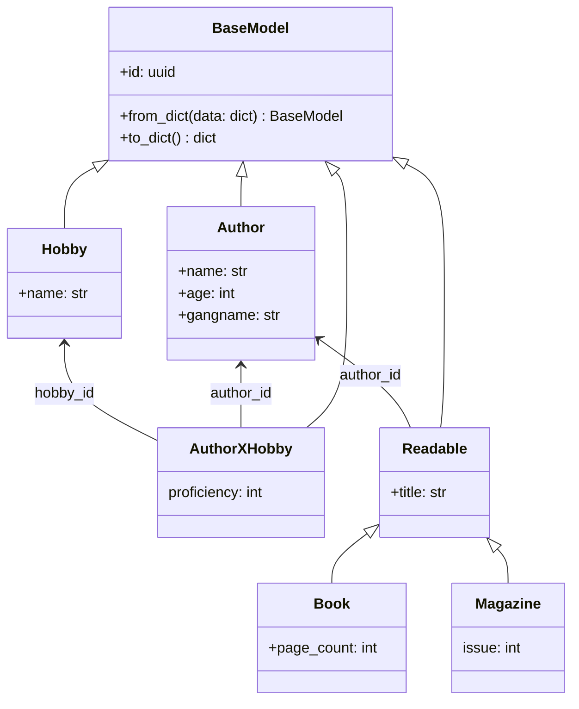
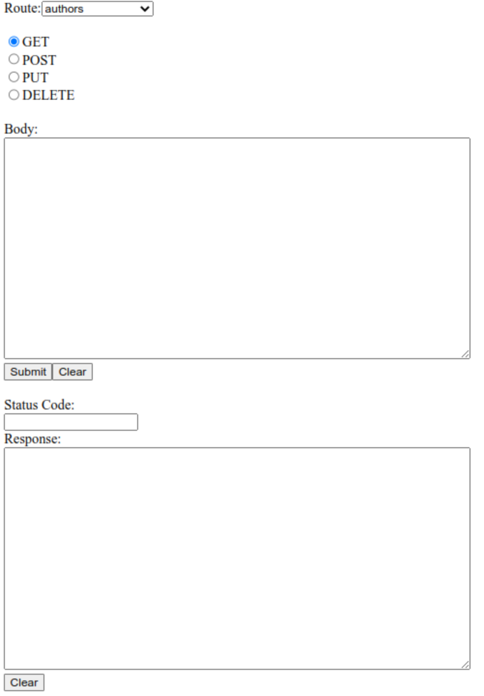

# flask-peewee-marshmallow-demo

## Short Description
This demo demonstrates the interaction of flask, peewee and marshmallow. It implements a simple model with `Authors` and `Readables` and `Books` and `Magazines` that inherit from `Readable`. Also `Authors` can have multiple `Hobbies`. There is a rudamentary frontend that lets you send requests to a Flask-API providing methods to create, show and delete elements. Marshmallow is used to serialize and deserialize objects. The ORM-model as well as the (de)serialization is defined in `src/model/*`. The API is defined in `src/app.py`.

## Class Diagram



Note that in order to be compatible with a relational database the many-to-many realtionship between `Author` and `Hobby` has to be modeled as an extra class.

## Detailed Description

### BaseModel

```python
from uuid import uuid4
from abc import abstractmethod

import marshmallow as marsh
from peewee import Model, SqliteDatabase, UUIDField

db = SqliteDatabase("db.sqlite3")


class BaseModel(Model):
    class Meta:
        database: SqliteDatabase = db

    class Schema(marsh.Schema):
        id = marsh.fields.String()

        @abstractmethod
        def _make(self, data: dict) -> 'BaseModel':
            raise NotImplementedError()

        @marsh.post_load
        def make(self, data: dict, **_) -> 'BaseModel':
            return self._make(data)

    id = UUIDField(primary_key=True, default=uuid4)

    @classmethod
    def from_dict(cls, data: dict) -> 'BaseModel':
        return cls.Schema().load(data)

    def to_dict(self) -> dict:
        return self.Schema().dump(self)
```

All models, that means all classes that should be persistent and written to the database, have to inherit from `BaseModel`. This provides some useful functionality.

1. Each model has an automatically generated id that is an UUID.
2. Each model is (de)serializable by using `from_dict` and `to_dict`. (powered by `marshmallow`)
3. Each model can (and must) define how it is built from a `dict` by overriding `_make`. But normally a [standard method](#simple-model) is sufficient.

### Simple Model

```python
import marshmallow as marsh
from peewee import TextField

from model.base_model import BaseModel


class Hobby(BaseModel):
    class Schema(BaseModel.Schema):
        name = marsh.fields.String(required=True)

        def _make(self, data: dict) -> 'Hobby':
            return Hobby(**data)

    name = TextField(null=False)
```

You can create your model by inheriting from `BaseModel`. You can add fields by just adding them as attributes like `name` in this example and setting it to a peewee field.

You also have to provide a marshmallow `Schema` inheriting from `BaseModel.Schema`. It specifies what attributes are considered for (de)serialization and how deserialization works. Therefore you define attributes with the same names as the peewee fields and setting them to corresponding marshmallow fields. With `_make` you define how deserialization works. Usually the standard method shown here is sufficient.

### Non Database Attributes

```python
class Author(BaseModel):
    class Schema(BaseModel.Schema):
        name = marsh.fields.String(required=True)
        age = marsh.fields.Integer(required=True)
        gangname = marsh.fields.String()

        def _make(self, data: dict) -> 'Author':
            return Author(**data)

    name = TextField(null=False)
    age = IntegerField()

    gangname: str

    def __init__(self, *, gangname: str = "", **kwargs):
        super().__init__(**kwargs)
        self.gangname = gangname
```

If you need attributes that are not persistent and stored in the database you can do it like in this example. Here `gangname` is not stored in the database. When you want `gangname` to be part of the (de)serialization you have to be a bit careful as to how you build `__init__`. I suggest the pattern shown in the example, enforcing the use of only keyword arguments using the single `*` and providing default values for the non-persistent attributes. An alternative would be to write a custom `_make`.

### Many-to-many Relations

```python
class AuthorXHobby(BaseModel):
    class Schema(BaseModel.Schema):
        hobby_id = marsh.fields.String(required=True)
        author_id = marsh.fields.String(required=True)
        proficiency = marsh.fields.Integer()

    hobby_id = ForeignKeyField(Hobby)
    author_id = ForeignKeyField(Author)
    proficiency = IntegerField(default=0)
```

Many-to-many Relations have to be madeled as seperate classes. Here we have a relation between `Author` and `Hobby` as one author can have many hobbies and also one hobby can be pursued by many authors. It is as simple has defining a class with ids of both classes.

You can also define further attributes as `proficiency` here in this example. Also note that you can define default values.

Foreign keys are modeled as simple strings in the marschmallow `Schema` as they are UUIDs.

### Inheritance

```python
import marshmallow as marsh
from peewee import ForeignKeyField, TextField, IntegerField

from model.author import Author
from model.base_model import BaseModel


class Readable(BaseModel):

    class Schema(BaseModel.Schema):
        title = marsh.fields.String(required=True)
        author_id = marsh.fields.String(required=True)

    title = TextField(null=False)
    author_id = ForeignKeyField(Author, null=False)

class Book(Readable):

    class Schema(Readable.Schema):
        page_count = marsh.fields.Integer()

        def _make(self, data: dict) -> 'Book':
            return Book(**data)

    page_count = IntegerField()

class Magazine(Readable):

    class Schema(Readable.Schema):
        issue = marsh.fields.Integer()

        def _make(self, data: dict) -> 'Magazine':
            return Magazine(**data)

    issue = IntegerField()
```

One model A can inherit from another model B. You only have to make sure that As `Schema` also inherits from Bs `Schema`.

## Usage
Run `poetry run python3 src/run.py`. Then open your browser and navigate to `localhost:5000`.

### Example Walkthrough
1. Start the server and open the frontend in your browser. You will see something like this:

You can select the route you want to request as well as the HTTP-method and the body for the request. After submitting the status code and the response body will be displayed.

2. Select `hobbies` and `POST` and enter into `body`:
```json
{
    "name": "moocs"
}
```
Then `Submit`. You should get Status Code `200`.

3. Select `hobbies` and `GET` then `Submit`. You should get Status Code `200` and a json body containing the previously created `Hobby`. You will need its `id` later.

4. Select `authors` and `POST` and enter into `Body`:
```json
{
    "name": "Meinel",
    "age": 64,
    "gangname": "DigilHells"
}
```
Then `Submit`. You should get Status Code `200`.

5. Select `authors` and `GET` then `Submit`. You should get Status Code `200` and a json body containing the previously created `Author`. You will need its `id` in the next step.

6. Select `author` (**singular!**) and `GET` and fill his `id` into the `Id1` field. After submitting you should also get the `Author` as JSON object in the response body. You can do the same with the `Hobby` by selecting `hobby`.

7. Select `authors-x-hobbies` and `POST`. Enter into the body:
```json
{
    "author_id": <AUTHOR_ID>,
    "hobby_id": <HOBBY_ID>,
    "proficiency": 42
}
```
Remeber that the ids are strings and therefore need `""`!
You have now created a hobby for the author.

8. Select `author-x-hobby` and `GET`. Enter the `author_id` from the last step into `Id1` and the `hobby_id` into `Id2` and `Submit`. You will get the `AuthorXHobby` JSON object in the response body.

9. Feel free to also look into `app.py` to explore what the routes are capable of. You can also experiment with the other routes that are not explained in this Wlakthrough.

## Further reading
[Peewee Quickstart](https://docs.peewee-orm.com/en/latest/peewee/quickstart.html)

[Marshmallow Quickstart](https://marshmallow.readthedocs.io/en/stable/quickstart.html)